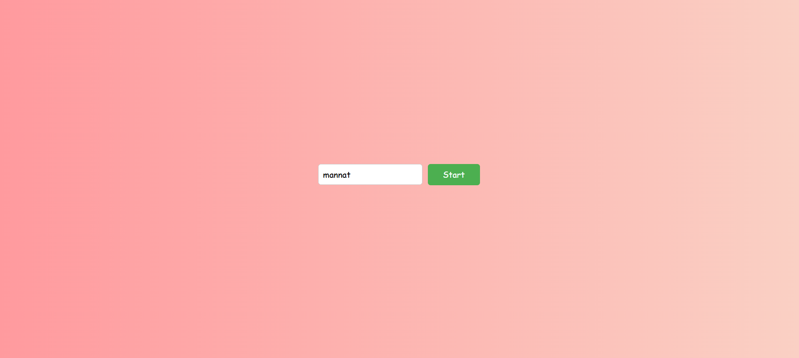
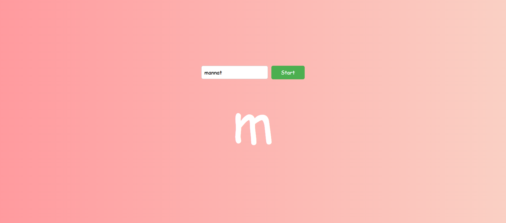
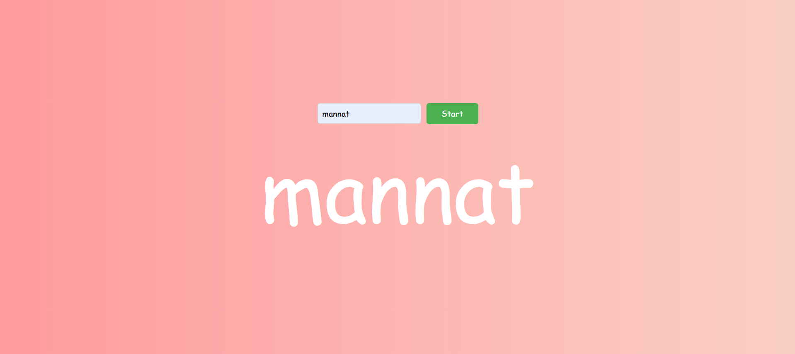

# Click to View

This is an interactive web application that takes a user-inputted word and reveals its letters one at a time with a click-to-view functionality. It provides a fun and visually engaging experience as the letters gradually appear.

## How It Works
1. **Input Section**: The user enters a word in the input field.
   

2. **Letter by Letter Display**: Each letter of the word is revealed one at a time as the user clicks.
   

3. **Complete Word**: Once all letters are clicked, the full word is revealed.
   

## Features
- **Interactive Click-to-View**: Displays letters one by one on user interaction.
- **Customizable Word Entry**: Supports any word length and content.
- **Transitions & Animations**: Smooth background transitions and letter reveal animations enhance the user experience.
- **Responsive Design**: Works seamlessly across different screen sizes and devices.
- **Visual Feedback**: Provides real-time feedback as letters are revealed.
- **Customizable Styling**: Easily update styles like background, font, and animation effects.

## Usage
1. Open the project in a web browser.
2. Enter your desired word in the input field.
3. Click the "Start" button.
4. Click on each letter to reveal them sequentially.
5. Once all letters are revealed, the complete word will be displayed.

## Benefits
- **Engaging User Experience**: Interactive and visually appealing design keeps users engaged.
- **Customizable**: Tailor the app to your preferences, adding unique styling and animations.
- **Accessible & Usable**: Works well on all devices and screen sizes.
- **Fun Learning Tool**: Can be used as a fun learning tool for letter recognition, spelling practice, or interactive games.

## Customization
You can modify the following aspects of the project:
- **CSS**: Customize the background gradient, font size, font family, and color scheme by editing `style.css`.
- **JavaScript**: Add animations like fade-in, slide-in, or different transitions.
- **Transitions**: Adjust the animation timing, easing functions, and effects to enhance the user interaction.

---

Made with ❤️, thank you!!
